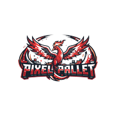

<h1 align="center">PixelPallet Mobile</h1>

Launcher Android do <strong>PixelPallet</strong> — jogue Pixelmon (Minecraft Java 1.12.2 + Forge) no seu celular.

---

## Sobre

O PixelPallet Mobile é baseado no **[PojavLauncher](https://github.com/PojavLauncherTeam/PojavLauncher)** (LGPL-3.0),
que roda Minecraft Java Edition no Android através de uma JVM embarcada. Este fork é
customizado para o servidor **PixelPallet**: já vem com a identidade visual, e o objetivo é
que o jogador baixe, instale e entre no servidor de Pixelmon direto do celular.

## ⚠️ Requisitos

- **Android** apenas (iOS não é suportado).
- Aparelho **potente**: Pixelmon é pesado, recomendado **6GB+ de RAM** (mín. ~3-4GB livres).
- Espaço de armazenamento para o Minecraft + Forge + mods.

## Build

O APK é gerado automaticamente pelo **GitHub Actions** (`.github/workflows/android.yml`) a cada push.
Baixe o artifact do build ou uma release.

## Créditos e licença

Este projeto é um fork do **PojavLauncher** (© PojavLauncherTeam) e mantém a licença **LGPL-3.0**.
Todo o crédito da base técnica vai para a equipe do Pojav. As customizações de marca são do PixelPallet.

Minecraft é uma marca da Mojang/Microsoft. Pixelmon é uma marca de seus respectivos donos.
Este projeto não é afiliado à Mojang, Microsoft ou à equipe do Pixelmon.
